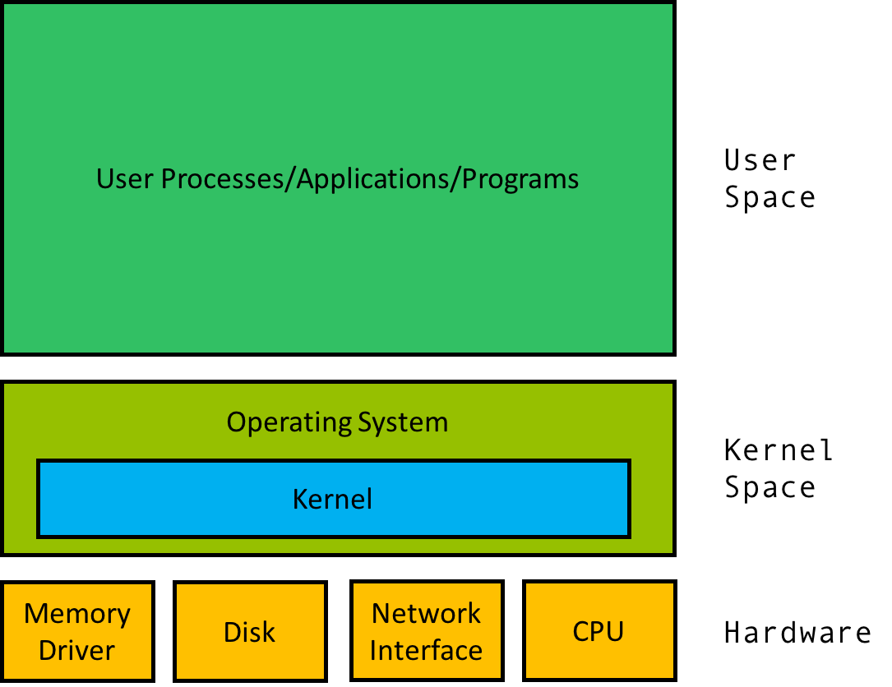

## Operating System (OS)

It is a program that is act an intermediary between a software and hardware in computer.

All OS performs all the basic tasks like file management , memory management , processes management , handling input and output and controlling peripheral devices such as disk drives ,flash ,printers , ……..

## The kernel of the system
It is the central control unit for everything that happens on your computer.

It is the core that provides basic services for all other parts of the OS



## Shell and Terminal
A shell is a user interface for access to an operating system’s services. Most often the user interacts with the shell using a command-line interface (CLI). 

The terminal is a program that opens a graphical window and lets you interact with the shell.

Shells in linux :  Bash, Zsh, C-

## Files types in liunx
1. **Normal File (-)**

    What it is: A standard file that contains actual data, text, or instructions.

    Examples: Text files (.txt), bash scripts (.sh), configuration files (.conf), images, or compiled binary executables.

    How it looks in ls -l: The line starts with a dash (-).
    ```bash
    -rw-r--r-- 1 user group 1024 Jul 29 document.txt
    ```

2. **Directory (d)**

    What it is: Technically, a directory is just a special type of file whose "data" is a list of other files and directories it contains.

    Purpose: It provides the hierarchical organizational structure of the Linux file system (the "tree" structure).

    Key Symbols:

    * **/ (Root):** The absolute top level of the entire file system. Everything stems from here.

    * **~ (Home):** A shortcut representing the current logged-in user's personal directory (e.g., /home/username).

    How it looks in ls -l: The line starts with a d.
    ```bash
    drwxr-xr-x 2 user group 4096 Jul 29 downloads/
    ```

3. **Symbolic Link (l)**

    What it is: Often called a "symlink" or "soft link," this is essentially a shortcut or a pointer to another file or directory elsewhere on the system.

    Why it is useful: It allows you to access a file from multiple locations without actually duplicating the data. If you delete the symbolic link, the original file remains completely safe. (However, if you delete the original file, the symlink becomes "broken" or "orphaned").

    How it looks in ls -l: The line starts with an l, and the end of the line usually shows an arrow (->) pointing to the real file's path.
    ```bash
    lrwxrwxrwx 1 user group 12 Jul 29 my_shortcut -> /path/to/real_file.txt
    ```

4. **Block Devices (b)**

    What it is: Hardware devices that read and write data in fixed-size blocks. The system buffers this data, meaning it reads a chunk, holds it in memory, and writes it in a chunk.

    Examples: Hard drives, SSDs, USB flash drives, and disk partitions. You will typically find these in the /dev directory (e.g., /dev/sda, /dev/nvme0n1).

    How it looks in ls -l: The line starts with a b.
    ```bash
    brw-rw---- 1 root disk 8, 0 Jul 29 09:00 /dev/sda
    ```

5. **Character Devices (c)**

    What it is: Hardware devices that send or receive data character by character (or byte by byte) in a continuous, unbuffered stream.

    Examples: Keyboards, mice, serial ports, and terminal interfaces (/dev/tty). The famous "black hole" of Linux, /dev/null, is also a character device.

    How it looks in ls -l: The line starts with a c.
    ```bash
    crw-rw-rw- 1 root root 1, 3 Jul 29 09:00 /dev/null
    ```

6. **Sockets (s)**

    What it is: A file used for Inter-Process Communication (IPC). It allows processes on the same machine to talk to each other without needing to send traffic through the network stack.

    Examples: You will often see these used by background services and databases. If you work with containers, the Docker daemon uses a socket (/var/run/docker.sock). PostgreSQL and X11 display servers also rely heavily on them.

    How it looks in ls -l: The line starts with an s.
    ```bash
    srw-rw---- 1 root docker 0 Jul 29 09:00 /var/run/docker.sock
    ```

7. **Named Pipes / FIFOs (p)**

    What it is: A pipe allows the output of one process to be fed directly into the input of another. While you often use standard anonymous pipes in the terminal (the | symbol), a named pipe (or FIFO: First-In, First-Out) exists as an actual file on the file system. Two completely separate scripts can read and write to this file simultaneously to share data.

    Examples: You can create one yourself using the mkfifo my_pipe command.

    How it looks in ls -l: The line starts with a p.
    ```bash
    prw-r--r-- 1 user group 0 Jul 29 09:00 my_pipe
    ```

## Anatomy of a Path

**The Separator (/):** In Linux, directories are always separated by a forward slash (unlike Windows, which historically uses a backslash \).

**The Root (/):** A single forward slash at the very beginning of a path represents the absolute top of the file system.

**The Home Directory (/home/username):** This is your personal workspace. Because typing this out is tedious, Linux provides the tilde (~) as a universal shortcut for your home directory.

When navigating or pointing to a file, you must use one of two types of paths: Absolute or Relative.

1. **Absolute Paths**

An absolute path is the complete, unambiguous address of a file or directory, starting from the very root of the system.

**The Golden Rule:** An absolute path always begins with a forward slash (/).

**When to use it:** When you are writing scripts, configuring services, or need to be 100% certain you are targeting the correct file, regardless of where you currently are in the terminal.

Example:
```bash
    # No matter where you are, this command will always read the same file
    cat /var/log/syslog
```

2. Relative Paths

A relative path is a shortcut address that starts from your Current Working Directory (where you currently are in the terminal).

**The Golden Rule:** A relative path never begins with a forward slash.

**When to use it:** When you are navigating around manually in the terminal and want to save keystrokes.

Special Symbols:

* **. (Single dot):** Represents your current directory.
* **.. (Double dot):** Represents the parent directory (one level up).

Examples:
```bash
    # If you are currently inside /home/username/ 
    # This relative path moves you into /home/username/downloads
    cd downloads/

    # This moves you up one level (from /home/username to /home)
    cd ..

    # This runs a script located in your current directory
    ./script.sh
```

