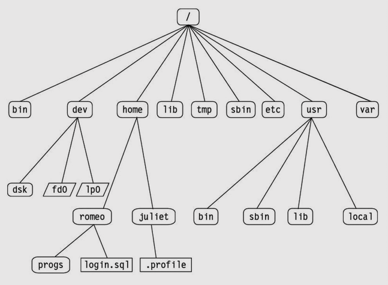

## 🌳 The Root of the Tree

Everything in Linux stems from / (The Root). From there, the FHS dictates specific purposes for top-level directories:

* **/etc:** System-wide configuration files (no executable binaries belong here).
* **/var:** Variable data files that are expected to grow in size (logs, databases, web servers)./home: Personal user directories.
* **/bin & /sbin:** Essential command binaries (like ls and cat) and system administrator binaries (like fdisk).

## ⚙️ Key Configuration Files

### **User & Authentication Management**
These files work together to manage who can access the system and what privileges they hold.

|File Path | Primary Purpose |
|----------|-----------------|
| /etc/passwd | Contains public info for registered users (username, user ID, home directory path). |
| /etc/shadow |Stores actual user passwords securely as encrypted hashes. Only readable by root. | 
| /etc/group | Lists all user groups on the system and shows which users belong to which group.| 

### **System & Identity Configuration**
These files define how the machine identifies itself and communicates.
|File Path | Primary Purpose |
|----------|-----------------|
| /etc/os-release | Shows the operating system name, version, and build details (e.g., Debian 13 Trixie). | 
| /etc/hostname | Contains the machine's local domain name. | 
| /etc/hosts | A manual DNS file used to map IP addresses to hostnames locally, bypassing external DNS servers.| 
| /etc/motd | "Message of the Day." The text stored here is printed in the terminal whenever a user logs in.| 

### **Variable Data**

Unlike /etc, which is mostly static text, /var is constantly changing.
|File Path | Primary Purpose |
|----------|-----------------|
| /var/www | The default root directory for web server files (used heavily by Apache and Nginx). | 
| /var/log | (Bonus note) The directory where almost all system and application logs are written. | 

### **bin folders**

#### **/bin (Essential User Binaries)**

* **What it is:** Contains the fundamental commands required for the system to boot or run in single-user recovery mode.
* **Who it is for:** All users.
* **Examples:** Core utilities you use constantly, like ls, cat, echo, cp, and bash.

#### **/sbin (Essential System Binaries)**

* **What it is:** Contains essential administrative commands needed to boot, network, or repair the operating system.
* **Who it is for:** The root user (or users with sudo privileges).
* **Examples:** Disk formatting tools (fdisk), firewall controllers (iptables), and system reboots (reboot).

#### **/usr/bin (General User Binaries)**

* **What it is:** The primary directory for executable programs installed by your operating system's package manager (like apt). These are not required to boot the system.
* **Who it is for:** All users.
* **Examples:** Most of your daily software, such as git, python3, tmux, or vim.

#### **/usr/local/bin (Locally Compiled Binaries)**

* **What it is:** This folder is strictly for software that you compile yourself or install manually, entirely bypassing the system's package manager.
* **Who it is for:** All users.
* **Why it exists:** It keeps your custom scripts and downloaded tools safely separated from the files managed by your OS. If you manually download a standalone binary (like a specific version of Node.js or a custom go-lang tool), it goes here.